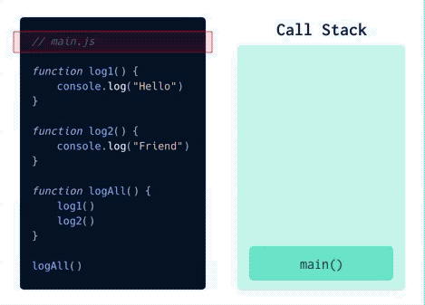
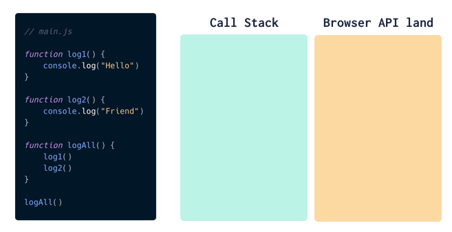
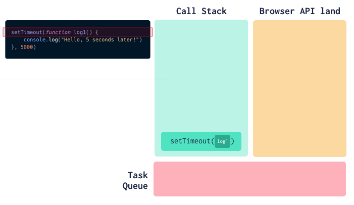
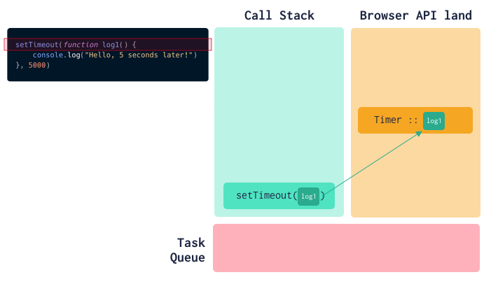
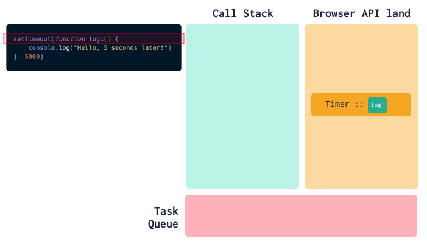
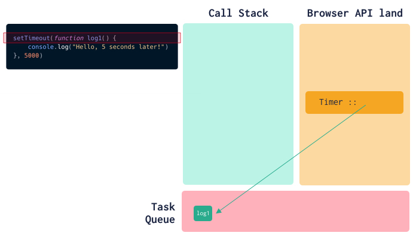
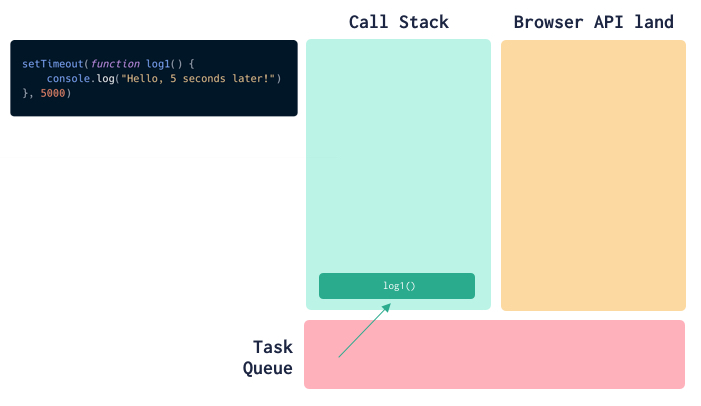
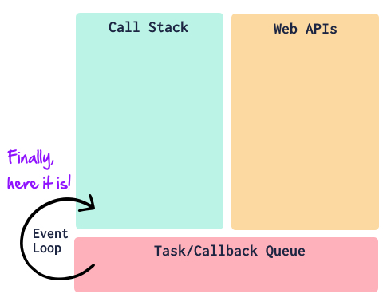

From time to time, I get a hankering to dive into a topic and crystallize any fuzziness in my understanding. Today is a classic- the JavaScript event loop.

## Getting Started

Before starting my research, I was pretty clueless about this topic. I vaguely thought it had something to do with event bubbling (hint: it doesn’t).

It turns out describing the event loop first requires peeling back a few layers of how the JavaScript runtime executes code. I’m still not an expert, but I now understand enough to be dangerous 😎.

Before we get any farther, a big shout out to Philip Roberts. His conference talk on "What the heck is the event loop anyway?" is _really_ good. I watched and read a handful of resources, but his was by far my favorite. You're probably better off leaving here and heading over to YouTube to [watch his talk](https://www.youtube.com/watch?v=8aGhZQkoFbQ).

## Some Curious Code

The best way to begin getting our minds around the event loop is to consider a bit of code which gives (perhaps) unexpected results:

```js
console.log('1')

setTimeout(() => {
  console.log('2')
}, 0) // notice the delay of 0

console.log('3')
```

What should I expect the result to be from this code? I’m mean sure, there’s a `setTimeout` call in there, but it has a delay of 0… so wouldn’t it execute immediately?

This would not be an outrageous guess:

```js
1
2
3 // simple enough, right?
```

Nope! Here’s the actual output we’d see:

```js
1
3 // what the....
2
```

The answer as to why, my friends, can be found by learning about the JavaScript event loop.

## Taking a Step Back

To understand our snippet of code from above, we need to take a step back and discuss four items about how JavaScript code is executed (in our case, within the context of the browser).

> Quick aside… we are venturing in to deeper waters in which I am not entirely licensed to swim. If you want to correct or call me out, jump on Twitter and @ me: [@markadamfoster](https://www.twitter.com/markadamfoster)

### Background info #1: JavaScript is single-threaded

JavaScript is single threaded. Perhaps you’ve heard that before. Well, we need to introduce some nuance here: the JavaScript _runtime_ (Chrome’s V8 JS engine, for instance) is single-threaded.

This means it only does one thing at a time. It has a single call stack (more about that in a second), and executes code line-by-line, one line at a time.

### Background info #2: The call stack

There’s another concept we need a brief introduction to in order to continue: the call stack.

The call stack is a data structure the JavaScript engine uses to keep track of where it currently is in the code (what code is currently being executed).

Let’s go through visual representation of the call stack, so we can see a bit of how it works. Consider this code:

```js
// we'll call this file "main.js"
function log1() {
  console.log('Hello')
}

function log2() {
  console.log('Friend')
}

function logAll() {
  log1()
  log2()
}

logAll()
```

As the JS engine executes the code, functions are added onto the top of the call stack, and then popped off once completed running. Here’s an animation to help visualize this:



### Background info item 3: Browser APIs

The problem with being single-threaded is when you need to do multiple things at a time. For instance: - wanting users to be able to click around while waiting for a network request to finish - needing to use setTimeout to delay a bit of code, but wanting everything else to finish executing in the meantime

Here’s the trick… the JS runtime is single-threaded, but _the browser_ is not. The browser can spin up multiple threads and do all sorts of fanciness.

So to give your JavaScript superpowers, there are browser APIs- functions you can use in your JavaScript code that are provided by the browser environment. `setTimeout` is one of these (along with the various DOM methods, Ajax methods, device APIs, audio/video methods, and more).

For `setTimeout` (for instance), you can call it in your code, but the actual bit of waiting for the specified amount of delay time is handled in browser-land.

We’ll represent this with a box next to our call stack box:



### Background info item 4: The task queue

Our last piece of necessary background information is the “task queue” (also known as the callback queue). The task queue is where our web API’s put callback functions which are now ready to run. They stay in the callback queue until the call stack is empty, and then they are executed (on a first-in, first-out basis).

Let’s explore this using our `setTimeout` friend again:

```js
setTimeout(function log1() {
  console.log('Hello, 5 seconds later!')
}, 5000)
```

This is a lovely little bit of code, as it uses all of the bits we’ve learned so far.

Here are the steps involved in executing this code:

1. The `setTimeout` call goes onto our call stack.



2. `setTimeout` is a method provided by our browser (or node) environment, so it spins up a timer and is given the callback function.



3. setTimeout is done executing, so it pops off the call stack.



4. After the 5 second delay, the `console.log` is ready to run. However, it can’t just be shoved onto the call stack. Instead, it is passed into the task queue.



5. When the call stack is empty (which for us it is, as this was a very simple bit of code), the first item in the task queue is moved into onto the call stack and executed.



## The JavaScript Event Loop

Ok! _Deep breath_.

Now we know enough to finally tackle our core question: What is the JavaScript event loop?

The good news is, we’ve already seen it in action! The JavaScript event loop is the mechanism that takes care of step 5 above.

> The event loop watches the call stack and watches the task queue. When the call stack is empty, it moves over the first item in the task queue.



## Back to our original code…

At this point, we should have a much better understanding of why our original code behaves the way it does.

```js
console.log('1')

setTimeout(() => {
  console.log('2')
}, 0)

console.log('3')
```

The reason our `console.log("2")` prints last, even though the delay is 0, is that it ends up going through the web API and into the task queue. The event loop will only move it from the task queue onto the call stack when the call stack is empty, and the call stack won’t be empty until _after_ it finishes executing `console.log("3")`. So we get:

```js
1
3
2 // 💡 ahhh... it all makes sense now.
```

Wahoo! We did it! 👏👏👏

## Corrections? Comments?

What was helpful? What did I get wrong? Let me know on Twitter! [@markadamfoster](https://www.twitter.com/markadamfoster)
