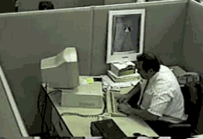

## TL;DR:

If you have a 2013, 2014, or 2015 MacBook Pro (either the 13 inch or 15 inch version), and are experiencing an issue with random shutdowns, the culprit may be a faulty “ethernet via thunderbolt” driver.

**Step-by-step instructions to fix (originally found [here](https://outluch.wixsite.com/rmbp-crash)):**

1. Reboot with CMD+R pressed
2. Open Terminal and run `csrutil disable` (you may need to add `sudo` if that command fails)
3. Reboot in normal mode
4. (Only if running Catalina) Open Terminal and run `sudo mount -uw /`
5. In Terminal, run

```
sudo mv /System/Library/Extensions/AppleThunderboltNHI.kext
/System/Library/Extensions/AppleThunderboltNHI.kext.BAK
```

6. Reboot again with CMD+R pressed
7. Open Terminal and run `csrutil enable`
8. Reboot again and forget about the problem

> Note: if you reinstall or update MacOS, you’ll need to redo these steps.

## The Issue

This was a rough one. For _years_ I had struggled with my MacBook randomly shutting off. For me, the precise symptoms were:

1. The computer would randomly freeze
2. Fans would kick on
3. Computer would stay on (but frozen) for about 5 seconds
4. Computer would shut down

At the time I couldn’t sort out what was going on, other than it seemed to happen the most when I was running on battery power.

Sometimes I would go a week or two between shutdowns, and other times it would happen 3 times within a 20 minute window.

System diagnostics didn’t reveal any problems, resetting SMC and NVRAM didn’t help, reinstalling MacOS didn’t help. I took it to the Apple Store, they couldn’t reproduce but said there was a 70% likelihood of it being fixed by replacing the battery (otherwise it was logic board or graphics card).

So I paid to get the battery replaced… and random shutdowns still happen.



## The Fix

I had googled the issue many times before, and I’m not sure what magic string of characters I typed this time, but I finally ran across people describing very similar behavior. They claimed to have fixed it one of two ways:

1. Removing the ethernet via thunderbolt driver, or
2. Running a python script that would keep a small amount of CPU churn happening at all times

I started with the first option, and the issue immediately went away. This was further confirmed when I updated to MacOS Catalina. The update re-installed the problematic driver, and a day later I had a random freeze and shut down. I then re-removed the driver, and have been fine since.

I’m posting this article just in the off-chance it can help someone else suffering from this issue.

## Resources

[https://outluch.wixsite.com/rmbp-crash](https://outluch.wixsite.com/rmbp-crash)
