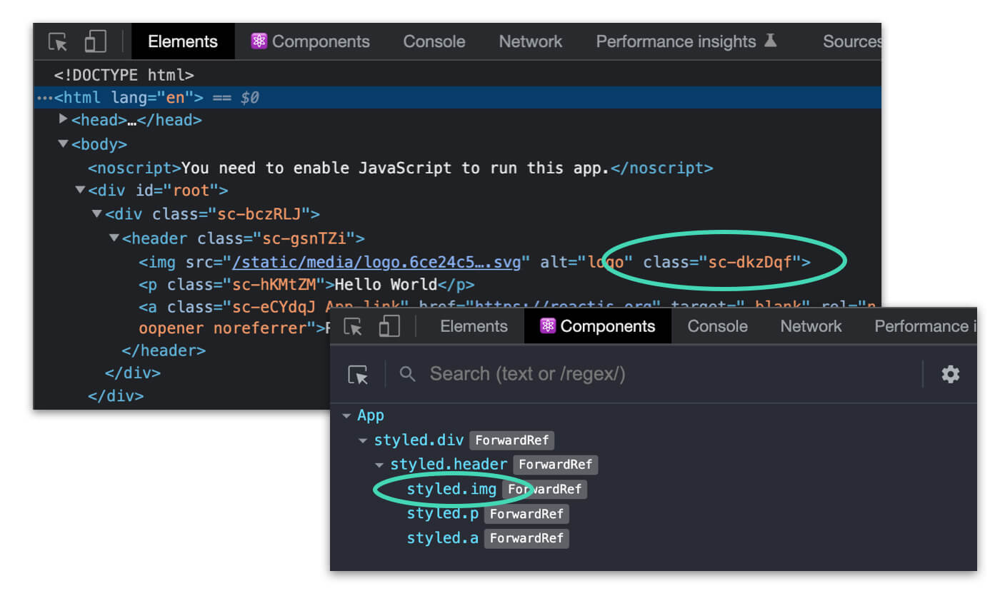
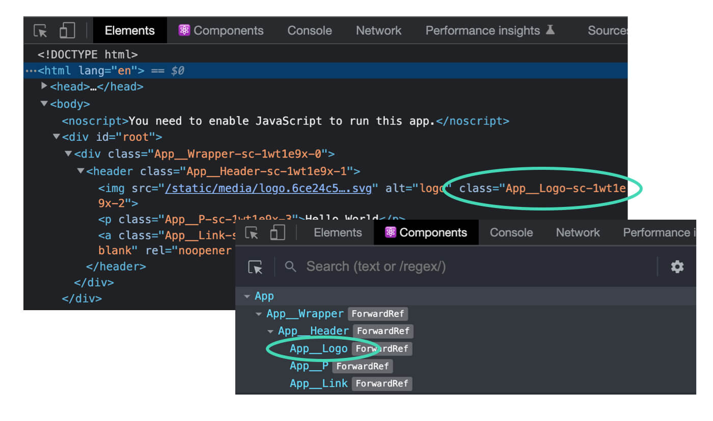

I love Styled Components, and have used it for years as my preferred CSS-in-JS library. But one annoyance is the randomly-generated class names can make using the inspector difficult:



Luckily, styled-components offers a Babel plugin to automatically add the React component display name to the generated classes (as well as in your React DevTools), which ends up looking like this:



In a large and complex app, this is _immensely_ helpful. So let's dig into getting this working with create-react-app.

## Import using the macro

To initially get this working with create-react-app, it’s only one small change. At the top of your file, rather than importing styled-components the normal way, you add a `/macro`, like this:

```js
// import styled from 'styled-components' <- old way

import styled from 'styled-components/macro' // ✨ new way
```

When you update the import statement to import from `styled-components/macro`, it will transpile your code using a Babel Macro and you’ll immediately start seeing the component names in the inspector.

One note, if you want this turned on _everywhere_ in your app, you’ll need to update all your styled-components import statements (in every file).

## What about on production?

By default, when importing via `styled-components/macro`, the updated class names will also show up in your production build. They are not dev-environment-only by default. If you _don’t_ want the updated class names to show up on production, you’ll need to add a configuration file to specify that:

1. Create a file in the root of your create-react-app project, with the filename of `.babel-plugin-macrosrc.js`
2. Add this:

```
module.exports = {
  styledComponents: {
    displayName: process.env.NODE_ENV !== "production"
  },
}
```

## More resources

- If you run into trouble, check out the official Styled Components Babel Macro docs: [styled-components: Tooling](https://styled-components.com/docs/tooling#babel-macro)
