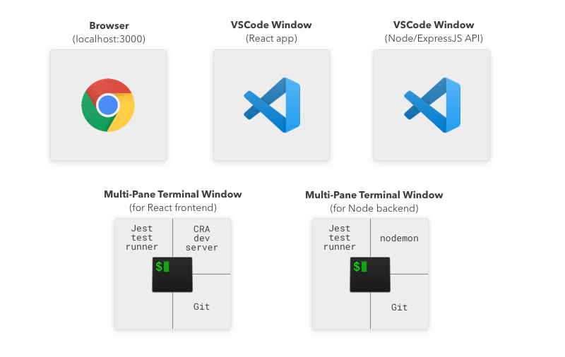

I have been wanting to be able to do a single-command quick-launch of text editors and multi-paned terminal windows for a *long time*.

Here’s what I mean... I want to be able to launch ALL of this by typing a single command:

This is the actual dev environment for one of my side projects. I don’t want to spend mental energy on getting this up and running each time. I just want to enter a single command into my terminal and have all these to spin up (including all the terminal items in a saved multi-pane arrangement).

After a ton of searching and testing, I’ve finally got it.

## The Magic Combination

1. **iTerm2** - Terminal application for Mac.
2. **itermocil** - For creating and launching pre-defined window/pane layouts in iTerm.
3. **bash/zsh alias** - For pretty-ing the initial command and launching the two itermocil projects/layouts in two different tabs.

*As you can tell, this is for a Mac. I'm sure there's a Windows equivalent, but I haven't looked for it.*

## Example Config
I'll go through the entire setup config from the side project I mentioned earlier. You should be able to use this as a starting point to dial in your exact process and window arrangement preferences.

In ~./itermocil, I have two files, one for the backend, one for the frontend:

## Resources
[How to Create Custom iTerm2 Window Arrangments](https://blog.andrewray.me/how-to-create-custom-iterm2-window-arrangments/)

## Corrections? Comments?

What was helpful? What did I get wrong? Let me know on Twitter! [@markadamfoster](https://www.twitter.com/markadamfoster)
