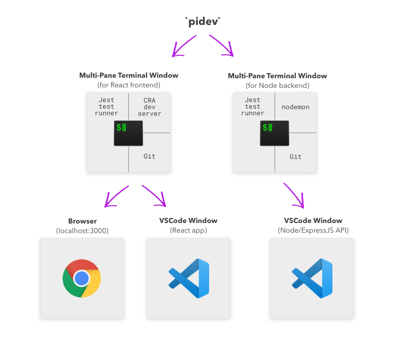

I have been trying to find a way to be able to do a single-command quick-launch of multiple text editors and multi-paned terminal windows for a _long time_.

Here’s an example from one of my side projects. I want to be able to launch all of these at once by typing a single command:


I don’t want to spend mental energy on getting this up and running each time. I just want to enter a single command into my terminal and have all these to spin up (including all the terminal items in a saved multi-pane arrangement).

After a ton of searching and testing, I’ve finally got it.

## The Magic Combination

1. **iTerm2** - Terminal application for Mac.
2. **itermocil** - For creating and launching pre-defined window/pane layouts and start commands in iTerm.
3. **bash/zsh alias** - For pretty-ing the initial command and launching the two itermocil projects/layouts in two different tabs.

_As you can tell, this is for a Mac. I'm sure there's a Windows equivalent, but I haven't looked for it._

## Example Config

I'll go through the entire setup config from the side project I mentioned earlier. You should be able to use this as a starting point to dial in your exact process and window arrangement preferences.

### 1. Getting started

The first step is to install both [**iTerm2**](https://www.iterm2.com/) and [**itermocil**](https://github.com/TomAnthony/itermocil). Click those links and follow the directions for both those tools.

### 2. itermocil config files

In the `~./itermocil` directory, I created two files, one for the backend, one for the frontend.

For my project, the frontend and backend use the same window arrangement and start commands that are sent to each pane, but it doesn't have to match, you can alter each itermocil config as needed.

_The project I set this up on is for Photo Invoice, so you'll see that scattered throughout. Replace that with your project name._

`photo-invoice-app.yml`:

```
windows:
  - name: photo-invoice-app
    root: ~/Dev/PhotoInvoice/app
    layout: main-vertical
    panes:
      - yarn run test
      - code .
      - yarn start
```

`photo-invoice-api`:

```
windows:
  - name: photo-invoice-api
    root: ~/Dev/PhotoInvoice/api
    layout: main-vertical
    panes:
      - yarn run test
      - code .
      - yarn start
```

_See the [itermocil docs](https://github.com/TomAnthony/itermocil) for more layout examples._

Each of these profiles opens three panes:

- `yarn run test` - in my project, this starts the Jest test runner, which will stay open and watch for changed files.
- `code .` - opens a VSCode window for the project
- `yarn start` - for the API Node/ExpressJS project, this runs nodemon. For the frontend project this starts the create-react-app dev server, which also opens a browser tab to localhost:3000

So by running these two itermocil profiles in separate iterm tabs, all the windows/panes from the graphic above are taken care of.

All that's left is setting up an alias to launch both of these profiles with a single terminal command.

### 3. Bash/zsh alias

I use zsh (with oh-my-zsh), so I've set up one extra zsh alias as follows:

```
alias pidev="itermocil photo-invoice-api; itermocil photo-invoice-app"
```

With this in place, by typing the command `pidev` and hitting enter, both itermocil profiles launch (in new iTerm tabs), each with 3 pre-arranged panes. The commands ran in the various iTerm panes open VSCode windows for that project and start the dev server, which also opens a browser window to localhost:3000:



WE DID IT! 🎉🎉🎉

Finding itermocil and putting these pieces together was a big win- I'd been wanting a setup like this for a long time. It's well worth the initial setup effort in order to save the time and mental energy of being able to launch the dev environment for a project with a single command.

## Resources

- [How to Create Custom iTerm2 Window Arrangments](https://blog.andrewray.me/how-to-create-custom-iterm2-window-arrangments/) - This is an excellent blog post about leveraging iTerm's "Restore Window Arrangement" feature to do something similar. The comments below the article are where I first discovered itermocil:

- [itermocil](https://github.com/TomAnthony/itermocil) - The official itermocil docs.

## Corrections? Comments?

What was helpful? What did I get wrong? Let me know on Twitter! [@markadamfoster](https://www.twitter.com/markadamfoster)
