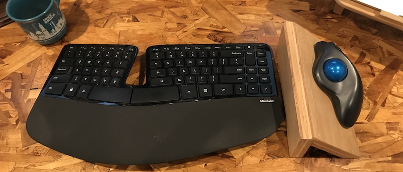
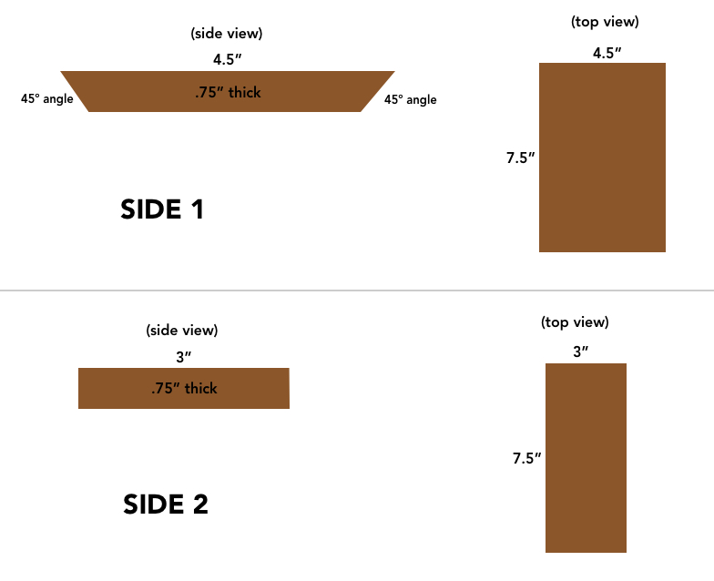
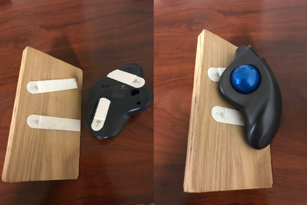
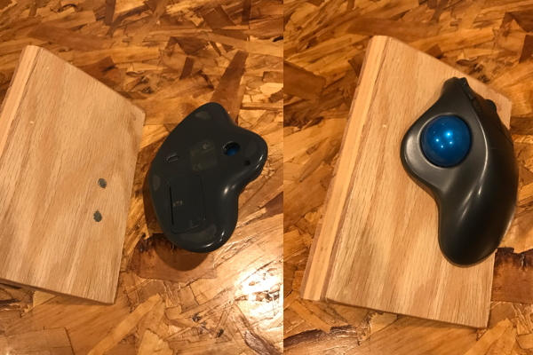
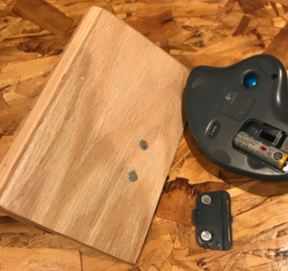
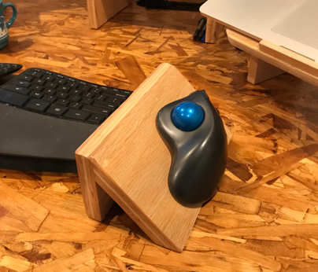

I spend _a lot_ of time working at a computer, which means I spend a lot of time using a keyboard and mouse.

A couple years ago I started to feel a small pain in my right wrist and forearm. I didn't give it much thought, and assumed it would eventually go away.

It didn't.

Eventually the pain got pretty serious, and grew to the point where I could barely use my mouse by the end of a workday. I wasn’t going to stop coding, but I needed a right arm. So I started exploring different types of mice and workstation setups.

At the time I had a co-worker who swore by his Logitech trackball:

Not what I would call a pretty device... but in the name of science and experimentation, I bought one on Amazon.

It helped. Instead of small, unnatural wrist movements, my wrist was now able to stay stationary, as just my thumb did the heavy lifting.

It wasn’t perfect though... it still felt unnatural to have my palm parallel to the desk surface. I wanted my wrist and hand to be in a totally natural position, which meant having it rest at an angle (approximately 45º degrees).

Armed with this knowledge, I headed out to my garage and built a wooden prototype stand to hold the trackball at an angle. I took it to work the next day, got a few strange looks, and haven’t felt wrist pain again.

I hear quite a few other software developers mention wrist pain, so I wanted to document what I'm currently using just in case it helps anyone else.

## Materials:

- Logitech trackball mouse - Or any other type of stationary mouse-like device. The only requirement is that it functions while stationary, since we’ll be attaching to the stand.
- A piece of wood - This needs to be at least ~8"x8". A leftover piece of 3/4” plywood works great.
- A saw (or friend with a saw) that can cut at a 45º angle
- A way to attach the two pieces of wood together - I used wood glue and a nail gun, but you could also use screws, etc.
- A way to attach your trackball to the stand

  - When in use, your trackball needs to be firmly attached to the stand, but also needs to be easily removable for cleaning and replacing batteries. The easiest way is with 3M velcro strips. The coolest way is with medium-small rare earth magnets. (I love magnets… I try to involve them in as many of my projects as possible. One of my favorite sayings is “or… we could accomplish this with magnets!")

## Instructions:

1. Cut the wood. Here are some rough dimensions to get you started:

2. Assemble the stand. If you’ve got the tools, I suggest using wood glue with a couple of finish nails.

3. Attach the trackball to the stand

   a. Option 1: use 3M velcro strips. The easiest (though least attractive).

   

b. Option 2: Magnets. Trickier, but soooooo worth it.

I got this to work by using superglue to attach two magnets to the inside of the trackball battery door, and then embedding the two corresponding magnets into the stand:

Voila! This setup has done wonders for me, and if you ever start getting a cranky wrist from too much mousing it’s worth a try. If you want to build your own and need any additional help, just [let me know](/about).

Happy track-balling!

