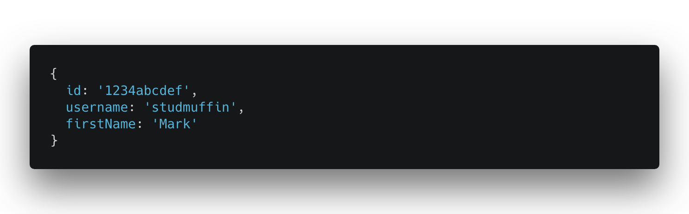
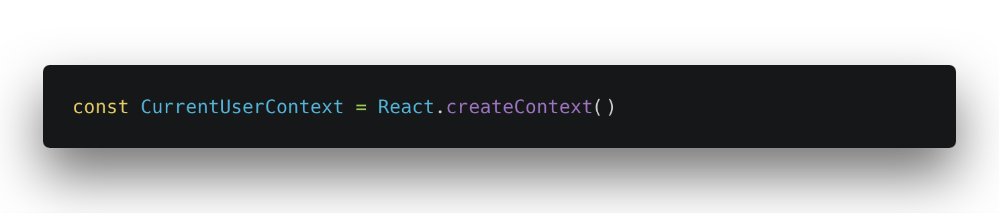
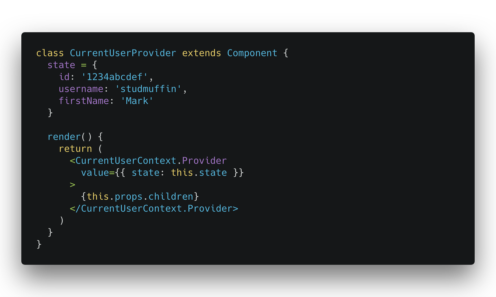
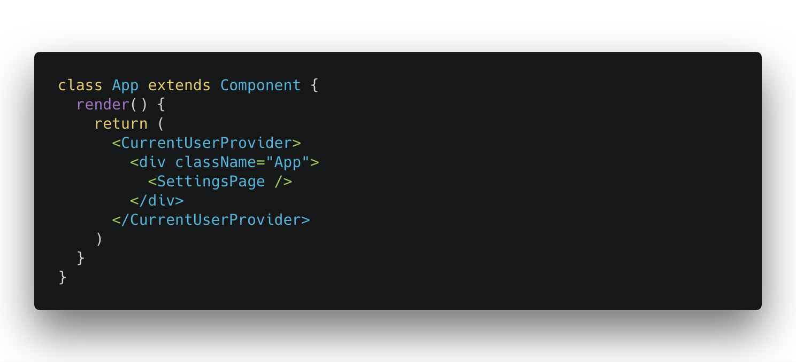
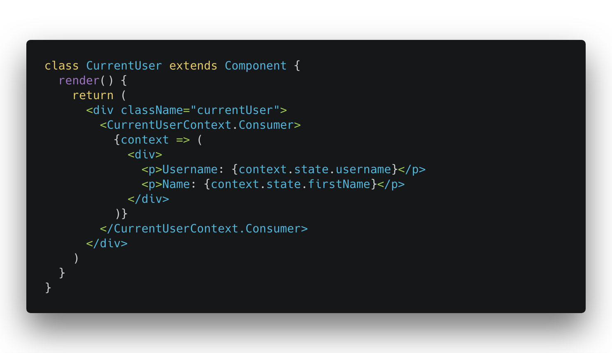
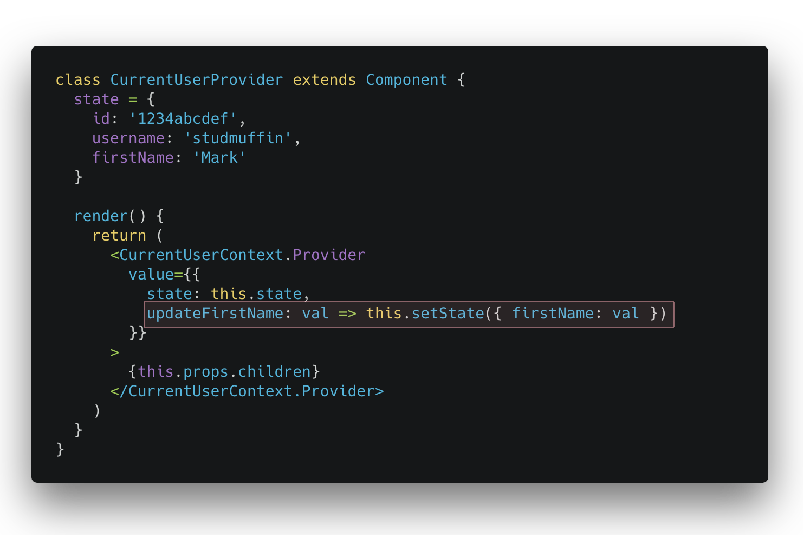
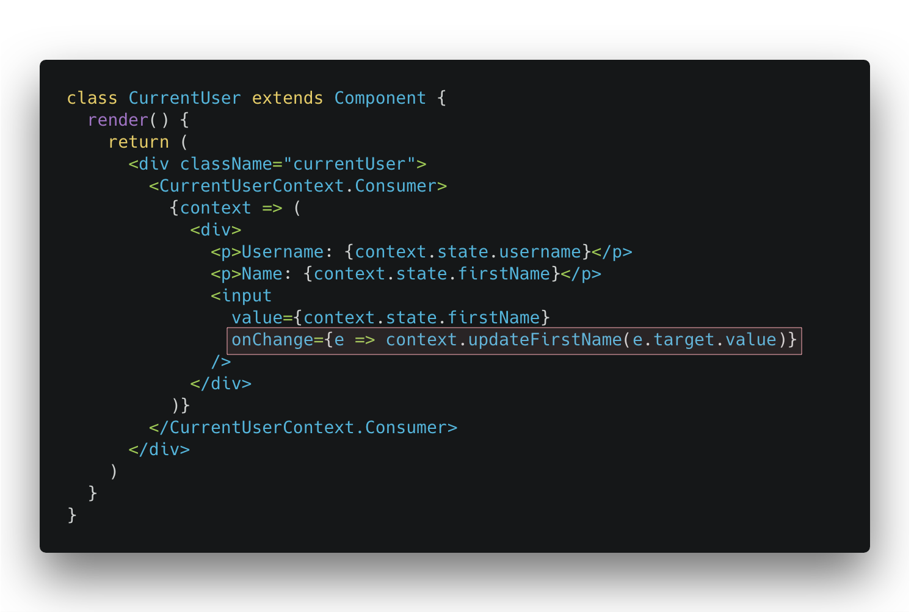
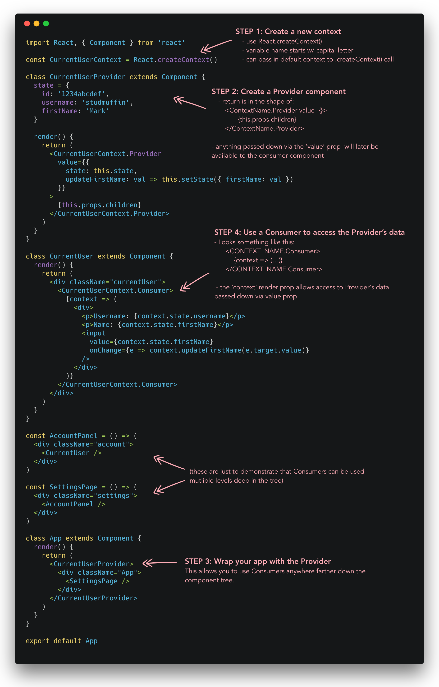

## What is it?

In v16.3, React included a new Context API, aimed at making it easier to pass data down to children that are multiple levels deep. From the official React docs:

> Context provides a way to pass data through the component tree without having to pass props down manually at every level.

If you are in the React world for very long, you inevitably witness a lot of conversations about state management, since it is both crucial and tricky. Redux has served as the community's primary state management solution for a couple years now. However, lately there has been a push to encourage folks to hold off from using Redux until it's truly necessary. Yes, the benefits are very real, but you don't need it on every project.

This is one of the reasons React's new Context API is especially exciting. It lengthens the runway even further before it is necessary to add a state management library to your project. It gives us (within vanilla React) a way to access & manage state in way that works well across an entire application, including child components in very different parts of the component tree.

## Implementation

Let's pretend we have an app that users can log into, and we need information about the currently logged in user throughout the app. This is a perfect candidate for using Context. Lets pretend the user info we want to make available looks like this:

### Step 1: Create a Context

The first thing we need to do is create a new context. this is done via the `React.createContext()` method. for our currently logged in user data, we'll call this context `CurrentUserContext` (notice it begins with an uppercase letter).

### Step 2: Create a Provider Component

The provider is the component that contains the shared data (as well as, we'll see later, the methods to manipulate that data).

Major items to notice:

1.  returns a component in the form of: `<ContextName.Provider>`
2.  component renders `{this.props.children}`
3.  passes down a `value` prop. This is how you can make data that can later be accessed by the other components that will need it.

### Step 3. Wrap your app with the provider

In order to make the provider accessible farther down the tree, your app will need to be wrapped by the provider component:

### Step 4. Create a consumer to access the provider's data

Now the fun part! Within the Provider, we can add a consumer that will give us access to the data we want to display (using the render prop pattern):

We have just one more step left: updating the data from within our consumer component.

### Step 5. Expose functions for updating the provider's data

In order to update data from within your consumer component, you can pass down functions in the provider's value prop, like so:

Your consumer can then access these functions by referencing `this.context`:

Not too bad! I'm not someone who picks up on new patterns immediately, but after watching the video from Wes Bos and manually typing all this out a couple times, it sank in pretty darn quickly.

## The Whole Thing:

## Explore the code:

- [CodeSandbox](https://codesandbox.io/s/4x5vv4x970)
- [Gist](https://gist.github.com/markadamfoster/bbaaf2e8e2f131eb1d848dcf167317f1)

## Resources

Here are the things I found particularly valuable while working on learning this:

- [Video by Wes Bos](https://wesbos.com/react-context/)
- [Official react docs](https://reactjs.org/docs/context.html)
- [Article by Kent C. Dodds](https://medium.com/dailyjs/reacts-%EF%B8%8F-new-context-api-70c9fe01596b)
