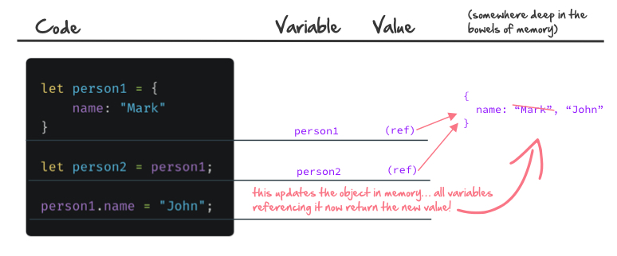

In JavaScript, a variable can point to a value, or to a _reference_ to a value. It’s easiest to explain with code:

```js
let name1 = 'Mark'
let name2 = name1
name2 = 'John'

console.log(name1) // Mark
console.log(name2) // John
```

No surprises here. Lines 1 & 2 set both variables to “Mark”, but then `name2` is reassigned to “John”:


Easy peasy.

Here’s where things get interesting:

```js
let person1 = {
  name: 'Mark',
}

let person2 = person1
person1.name = 'John'

console.log(person1.name) // "John"
console.log(person2.name) // "John" (❗️What the?!)
```

Whoa! We changed person1’s name… but we never changed person2’s name. How did both of them get switched from “Mark” to “John”?

## Values vs References

When we declare a variable and set it to a primitive type value (think string or number), JavaScript treats it in the way we’d expect. You can safely think of the variable as _containing_ (or being the same as) that value.

With arrays and objects, it’s different. When you assign an array or object to a variable, it is assigned a _reference_ to that array.

So what does that mean? It means in the code above, when we declared `let person2 = person1`, it did not create a new copy of `person1` in memory. Instead, JavaScript points both `person1` and `person2` to the same object in memory. Both variables _refer_ to the same object.

Here’s a visual to help demonstrate the concept:



As you can see, `person1` and `person2` are both pointing to the same object in memory. When we wrote `person1.name = "John"`, it updated the object in memory, which both variables are pointing to.

## Practical Takeaways

This whole thing is why you’ll often hear the advice to be very careful when mutating data. It’s easy to update an object or array in one part of your code, and not realize other variables are referencing the same, newly mutated data.

In fact, a best practice is to _not_ mutate data at all, and instead do your manipulations on a _copy_ of the data, leaving the original intact.

## Want more?

[https://codeburst.io/explaining-value-vs-reference-in-javascript-647a975e12a0](https://codeburst.io/explaining-value-vs-reference-in-javascript-647a975e12a0)

## Corrections? Comments?

What was helpful? What did I get wrong? Let me know on Twitter! [@markadamfoster](https://www.twitter.com/markadamfoster)
