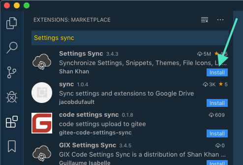
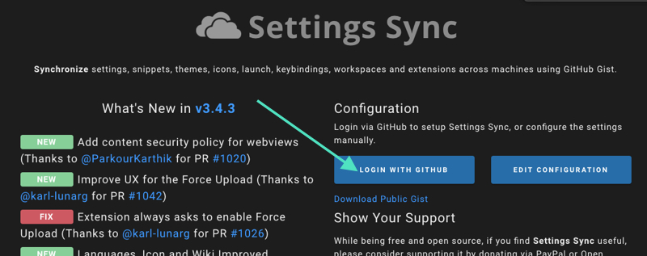
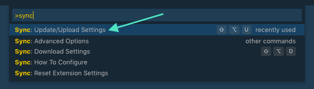
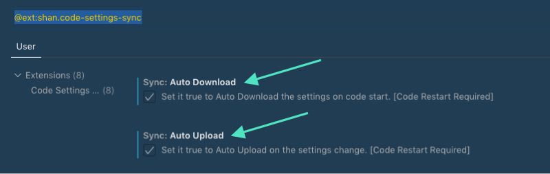

I had to take my laptop into the Apple Store for service the other day, and was left using my wife’s super old computer for a few days. After digging it out, wiping the hard drive and re-installing the latest OS X version it could handle, I set about trying to replicate my normal setup.

After spending a couple hours installing applications and cloning GitHub repos, I was able to get back into writing code. It wasn't until then I realized a crucial item I was missing: my VSCode settings and custom snippets.

I re-created a few, but was mostly out of luck. *But you don’t need to be.* Take a moment to set this up now, and you’ll be grateful you did the next time you have to set up a new machine.

The VSCode extension we’ll be using is [Settings Sync](https://marketplace.visualstudio.com/items?itemName=Shan.code-settings-sync). It lets you use a GitHub gist to track and sync your VSCode customizations, such as:

- Settings
- Keybindings
- Launch File
- Snippets
- Extensions (and Configurations)
- Workspaces

## Setting It Up
### On your primary computer:
1. Install the **Settings Sync** extension
   

2. Click the **Login with GitHub** button and follow the steps to grant access.

3. Skip the step of selecting an existing settings gist (since you haven't made one yet).
4. Back in VSCode, open the command palette, type "sync", and then select the **Update/Upload Settings** option

5. (optional) Turn on the Auto Download and Auto Upload settings.

### On your secondary computer:

The process here is very similar, except you'll do a settings download rather than upload.

1. Install the **Settings Sync** extension
2. Click the **Login with GitHub** button and follow the steps to grant access, and then select the settings gist created from before.
3. Via the VSCode command palette, type "sync", and then select the **Download Settings** option.
4. (optional) Turn on the Auto Download and Auto Upload settings. 

That’s it! Pretty slick. And definitely worth donating a couple bucks to the creator (there’s a donate button on the [extension page](https://marketplace.visualstudio.com/items?itemName=Shan.code-settings-sync)).

Also, a shout out to this [blog post](https://mikefrobbins.com/2019/03/21/backup-and-synchronize-vscode-settings-with-a-github-gist/) from Mike Robbins, which is the first place I ran across this extension when I started Googling for options.

## Corrections? Comments?

What was helpful? What did I get wrong? Let me know on Twitter! [@markadamfoster](https://www.twitter.com/markadamfoster)
