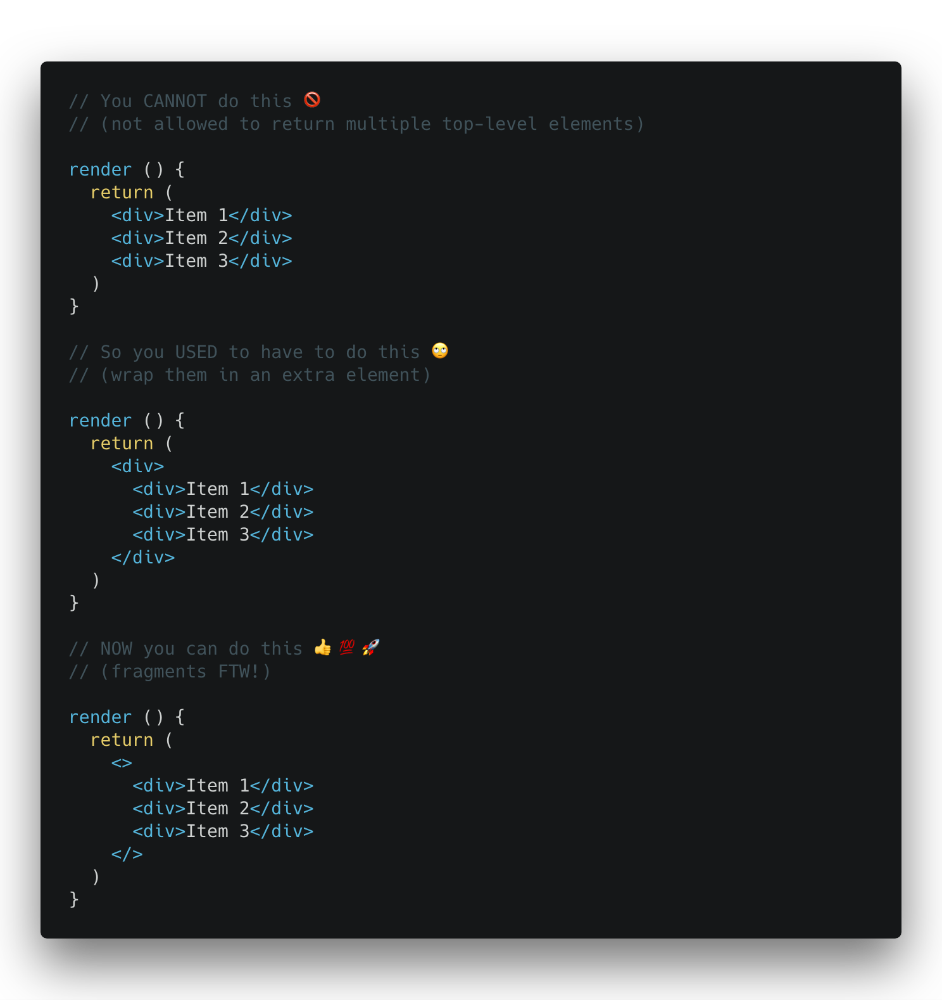

Sometimes there are topics I hear about and want to dig into, but don't have time to right away.

Then my mind starts to play tricks on me and it somehow becomes more and more difficult to return to them later. I just keep putting it off. It festers, and it takes waaayyyyy longer than it should before I finally set aside time for it. Then I realize it was pretty darn simple and I should have just knocked it out right away.

React's new [Fragments](https://reactjs.org/docs/fragments.html) feature is one of those things.

Fragments are a handy way to return multiple elements from a component without having to wrap them in a container:

Note: the `<></>` bit is called "Fragment Syntax", and not all tools support it yet. You can see tooling status updates [here](https://reactjs.org/blog/2017/11/28/react-v16.2.0-fragment-support.html#support-for-fragment-syntax), and you can always use `<React.Fragment></React.Fragment>` in the meantime if your tools aren't caught up yet. You'll also need to use `<React.Fragment>` if you need to pass in a key (or any other attribute).

That's it!
