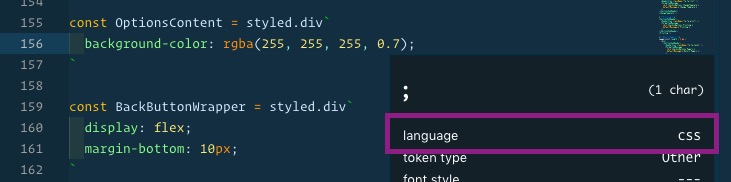

I’m a huge fan of the CSS-in-JS library [Styled Components](https://www.styled-components.com/), but I recently had an issue I struggled to solve: my Visual Studio Code snippets weren’t working within a styled-components tagged template literal.

```js
const MyStyledComponent = styled.div`
  background: purple;
`
```

_When I say “tagged template literal”, I’m referring to the code between the backticks._

Granted, Emmet shortcuts take care of most of my CSS shortcut needs, but I found myself wanting to create a few custom code snippets, especially for certain media queries box-shadow defaults, rgba values, etc.

But I couldn’t get them to work! I’d code it up and include it with the rest of my React snippets, but it would never show in the list of options when I typed the trigger characters.

I finally found the answer to my culprit in an old, closed [GitHub issue](https://github.com/Microsoft/vscode/issues/46792). As usual, it turns out VSCode is smarter than I am. Within the tagged template literal, VSCode knows that the language is not JavaScript or React… it’s CSS. Moving the snippets to my `css.json` snippets file instantly solved the issue.

If you’re ever in doubt, you can find out what language VSCode considers to currently be in scope (and hence, where your snippet should go) by:

1. Access the command palette (cmd-shift-p)
2. Open **Developer: Inspect TM Scopes**
3. Look for the **language** property



Happy snippet-ing!

## Follow me on Twitter!

Want more? Did I get something wrong? [@markadamfoster](https://www.twitter.com/markadamfoster)
